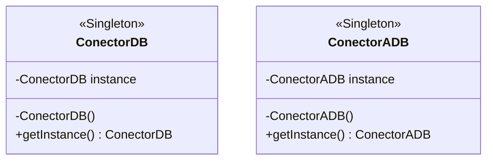

# Patrón Singleton — Conectores

Ejercicio de **Patrones de Diseño** que implementa el patrón creacional **Singleton** utilizando dos formas diferentes de inicialización.

## Objetivo

Garantizar que exista una única instancia de un conector y ofrecer un punto de acceso global y controlado a esa instancia.

El repositorio compara dos implementaciones del mismo patrón:

- `ConectorDB`: inicialización diferida (*lazy initialization*).
- `ConectorADB`: inicialización anticipada (*eager initialization*).

## Patrón aplicado: Singleton

**Singleton** restringe la creación de objetos de una clase a una única instancia. Para lograrlo, el constructor es privado y la propia clase administra la instancia que devuelve mediante `getInstance()`.

### Variante diferida — `ConectorDB`

La instancia comienza siendo `null` y se crea recién cuando `getInstance()` es llamado por primera vez.

### Variante anticipada — `ConectorADB`

La instancia se crea al inicializar la clase y `getInstance()` simplemente devuelve ese objeto.

## Diagrama UML del dominio



> `ConectorDB` crea la instancia de forma diferida, mientras que `ConectorADB` la crea de forma anticipada. En ambas clases, `instance` y `getInstance()` son miembros estáticos.

## Funcionamiento

En ambas implementaciones:

1. El constructor es privado, por lo que no puede utilizarse `new` desde otras clases.
2. La instancia pertenece a la propia clase mediante un atributo `static`.
3. `getInstance()` devuelve siempre la misma referencia.

La diferencia está en el momento en que se crea esa instancia.

## Estructura principal

```text
src/
├── main/java/ar/edu/unahur/obj2/conexion/
│   ├── ConectorDB.java
│   └── ConectorADB.java
└── test/java/ar/edu/unahur/obj2/conexion/
    ├── ConectorDBTest.java
    └── ConectorADBTest.java
```

## Ejecutar las pruebas

Desde la raíz del proyecto:

```bash
mvn test
```

## Conceptos practicados

- Patrón Singleton.
- Constructores privados.
- Atributos y métodos estáticos.
- Inicialización diferida y anticipada.
- Control de la creación de objetos.
- Pruebas unitarias con JUnit.
